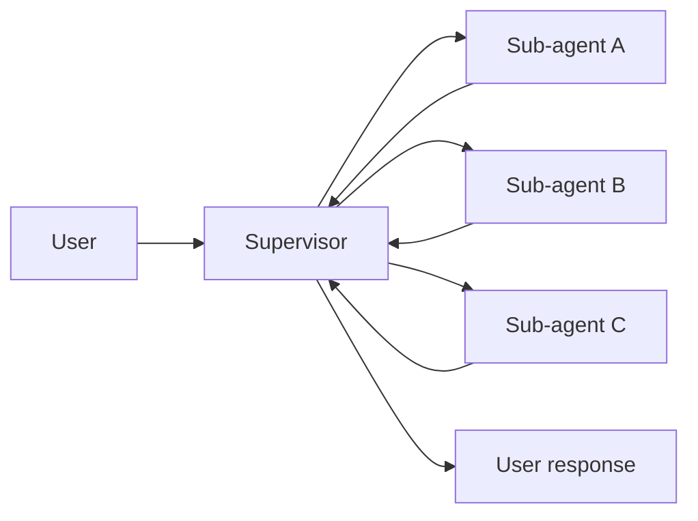
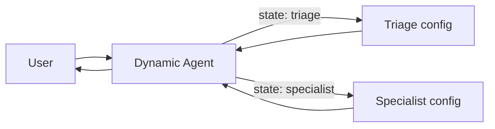
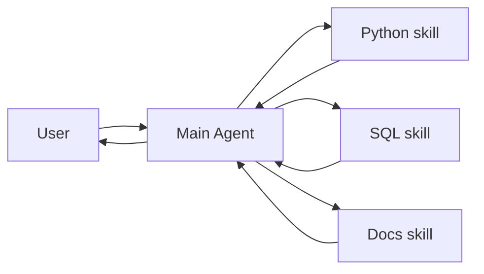

Multi-agent systems break complex applications into coordinated components. **Importantly, "multi-agent" doesn't necessarily mean multiple distinct agents** — a single agent with dynamic behavior can achieve similar capabilities.

## Why multi-agent?

When developers say they need "multi-agent," they're usually looking for one or more of these capabilities:

* **Context management**: Provide specialized knowledge without overwhelming the model's context window. If context were infinite and latency zero, you could dump all knowledge into a single prompt — but since it's not, you need patterns to selectively surface relevant information.
* **Distributed development**: Allow different teams to develop and maintain capabilities independently, composing them into a larger system with clear boundaries and independent testing.
* **Parallelization**: Spawn specialized workers for subtasks and execute them concurrently.

## When to use

Consider multi-agent patterns when:

* A single agent has too many [tools](/oss/langchain/tools) and makes poor decisions about which to use.
* [Context](/oss/concepts/context) or [memory](/oss/langchain/short-term-memory) grows too large for one agent to track effectively.
* Tasks require **specialization** (e.g., a planner, researcher, math expert).
* You need to **enforce sequential constraints** — unlocking capabilities only after certain conditions are met.
* Different teams need to **develop and maintain capabilities independently**.

## Context engineering

At the center of multi-agent design is **[context engineering](/oss/langchain/context-engineering)** — deciding what information each agent sees. LangChain gives you fine-grained control over:

* Which parts of the conversation or state are passed to each agent.
* Specialized prompts tailored to sub-agents.
* Inclusion/exclusion of intermediate reasoning.
* Customizing input/output formats per agent.

The quality of your system depends on context engineering. The goal is to ensure that each agent has access to the correct data it needs to perform its task, whether it's acting as a tool or as an active agent.

## Patterns

There are four main patterns for building multi-agent systems, each suited to different use cases:

| Pattern | How it works |
|--------------|--------------|
| [**Supervisor**](#supervisor) | A supervisor agent calls other agents as tools. Centralized control — all routing passes through the supervisor. |
| [**Dynamic agent**](#dynamic-agent) | Single agent whose available tools and capabilities change based on state/memory. Useful for enforcing sequential constraints or conditionally unlocking features. |
| [**Skills**](#skills) | Specialized prompts loaded on-demand. The main agent stays in control and gains additional context as needed. |
| [**Custom workflow**](#custom-workflow) | Build bespoke logic with LangGraph, mixing deterministic and agentic steps. Reuse or customize agents as needed. |

<Tip>
    You can mix architectures! For example, a **supervisor** can manage **workflow** sub-graphs, or a **dynamic agent** can invoke **skills** at certain stages.
</Tip>

## Supervisor

In the **supervisor** architecture, a central supervisor agent coordinates sub-agents by calling them as tools. The supervisor decides which sub-agent to invoke, what input to provide, and how to combine results.



**Key characteristics:**

* **Centralized control**: All routing passes through the supervisor
* **Sub-agents as tools**: Each sub-agent is wrapped as a callable tool
* **No direct user interaction**: Sub-agents return results to the supervisor, not the user
* **Parallel execution**: The supervisor can invoke multiple sub-agents in a single turn

Use the supervisor pattern when you have **multiple distinct domains** (e.g., calendar, email, CRM, database), sub-agents **don't need to converse directly** with users, or you want **centralized workflow control**. For simpler cases with just a few tools, use a single agent.

<Card
    title="Tutorial: Build a supervisor agent"
    icon="sitemap"
    href="/oss/langchain/supervisor"
    arrow cta="Learn more"
>
    Learn how to build a personal assistant using the supervisor pattern, where a central supervisor agent coordinates specialized worker agents.
</Card>

### Example

The example below shows how a main agent is given access to a single sub-agent via a tool definition:

:::python
```python
from langchain.tools import tool
from langchain.agents import create_agent


subagent1 = create_agent(model="...", tools=[...])

@tool(
    "subagent1_name",
    description="subagent1_description"
)
def call_subagent1(query: str):
    result = subagent1.invoke({
        "messages": [{"role": "user", "content": query}]
    })
    return result["messages"][-1].content

agent = create_agent(model="...", tools=[call_subagent1])
```
:::
:::js
```typescript
import { createAgent, tool } from "langchain";
import * as z from "zod";

const subagent1 = createAgent({...});

const callSubagent1 = tool(
  async ({ query }) => {
    const result = await subagent1.invoke({
      messages: [{ role: "user", content: query }]
    });
    return result.messages.at(-1)?.text;
  },
  {
    name: "subagent1_name",
    description: "subagent1_description",
    schema: z.object({
      query: z.string().describe("The query to to send to subagent1."),
    }),
  }
);

const agent = createAgent({
  model,
  tools: [callSubagent1]
});
```
:::

In this pattern:

1. The main agent invokes `call_subagent1` when it decides the task matches the sub-agent's description.
2. The sub-agent runs independently and returns its result.
3. The main agent receives the result and continues orchestration.

### Where to customize

There are several points where you can control how context is passed between the main agent and its subagents:

1. **Sub-agent name** (`"subagent1_name"`): This is how the main agent refers to the sub-agent. Since it influences prompting, choose it carefully.
2. **Sub-agent description** (`"subagent1_description"`): This is what the main agent knows about the sub-agent. It directly shapes how the main agent decides when to call it.
3. **[Input to the sub-agent](#control-the-input-to-the-sub-agent)**: You can customize this input to better shape how the sub-agent interprets tasks. In the example above, we pass the agent-generated `query` directly.
4. **[Output from the sub-agent](#control-the-output-from-the-sub-agent)**: This is the response passed back to the main agent. You can adjust what is returned to control how the main agent interprets results. In the example above, we return the final message text, but you could return additional state or metadata.

#### Sub-agent input

There are two main levers to control the input that the main agent passes to a sub-agent:

* **Modify the prompt**: Adjust the main agent's prompt or the tool metadata (i.e., sub-agent's name and description) to better guide when and how it calls the sub-agent.
* **Context injection**: Add input that isn't practical to capture in a static prompt (e.g., full message history, prior results, task metadata) by adjusting the tool call to pull from the agent's state.

:::python
```python
from langchain.agents import AgentState
from langchain.tools import tool, ToolRuntime

class CustomState(AgentState):
    example_state_key: str

@tool(
    "subagent1_name",
    description="subagent1_description"
)
def call_subagent1(query: str, runtime: ToolRuntime[None, CustomState]):
    # Apply any logic needed to transform the messages into a suitable input
    subagent_input = some_logic(query, runtime.state["messages"])
    result = subagent1.invoke({
        "messages": subagent_input,
        # You could also pass other state keys here as needed.
        # Make sure to define these in both the main and subagent's
        # state schemas.
        "example_state_key": runtime.state["example_state_key"]
    })
    return result["messages"][-1].content
```
:::
:::js
```typescript
import { createAgent, tool, AgentState, ToolMessage } from "langchain";
import { Command } from "@langchain/langgraph";
import * as z from "zod";

// Example of passing the full conversation history to the sub agent via the state.
const callSubagent1 = tool(
  async ({query}) => {
    const state = getCurrentTaskInput<AgentState>();
    // Apply any logic needed to transform the messages into a suitable input
    const subAgentInput = someLogic(query, state.messages);
    const result = await subagent1.invoke({
      messages: subAgentInput,
      // You could also pass other state keys here as needed.
      // Make sure to define these in both the main and subagent's
      // state schemas.
      exampleStateKey: state.exampleStateKey
    });
    return result.messages.at(-1)?.content;
  },
  {
    name: "subagent1_name",
    description: "subagent1_description",
  }
);
```
:::

#### Sub-agent output

Two common strategies for shaping what the main agent receives back from a sub-agent:

* **Modify the prompt**: Refine the sub-agent's prompt to specify exactly what should be returned.
  * Useful when outputs are incomplete, too verbose, or missing key details.
  * A common failure mode is that the sub-agent performs tool calls or reasoning but does **not include the results** in its final message. Remind it that the controller (and user) only see the final output, so all relevant info must be included there.
* **Custom output formatting**: Adjust or enrich the sub-agent's response in code before handing it back to the main agent.
  * Example: pass specific state keys back to the main agent in addition to the final text.
  * This requires wrapping the result in a @[`Command`] (or equivalent structure) so you can merge custom state with the sub-agent's response.

:::python
```python
from typing import Annotated
from langchain.agents import AgentState
from langchain.tools import InjectedToolCallId
from langgraph.types import Command


@tool(
    "subagent1_name",
    description="subagent1_description"
)
# We need to pass the `tool_call_id` to the sub agent so it can use it to respond with the tool call result
def call_subagent1(
    query: str,
    tool_call_id: Annotated[str, InjectedToolCallId],
# You need to return a `Command` object to include more than just a final tool call
) -> Command:
    result = subagent1.invoke({
        "messages": [{"role": "user", "content": query}]
    })
    return Command(update={
        # This is the example state key we are passing back
        "example_state_key": result["example_state_key"],
        "messages": [
            ToolMessage(
                content=result["messages"][-1].content,
                # We need to include the tool call id so it matches up with the right tool call
                tool_call_id=tool_call_id
            )
        ]
    })
```
:::
:::js
```typescript
import { tool, ToolMessage } from "langchain";
import { Command } from "@langchain/langgraph";
import * as z from "zod";

const callSubagent1 = tool(
  async ({ query }, config) => {
    const result = await subagent1.invoke({
      messages: [{ role: "user", content: query }]
    });

    // Return a Command to update multiple state keys
    return new Command({
      update: {
        // Pass back additional state from the subagent
        exampleStateKey: result.exampleStateKey,
        messages: [
          new ToolMessage({
            content: result.messages.at(-1)?.text,
            tool_call_id: config.toolCall?.id!
          })
        ]
      }
    });
  },
  {
    name: "subagent1_name",
    description: "subagent1_description",
    schema: z.object({
      query: z.string().describe("The query to send to subagent1")
    })
  }
);
```
:::


## Dynamic agent

In the **dynamic agent** architecture, you have a single agent whose behavior (prompt, tools, and capabilities) changes dynamically based on state. Under the hood, this is a state machine implemented via [middleware](/oss/langchain/middleware/overview) that performs handoffs through tool calls.



**Key characteristics:**

* **Single agent, multiple configurations**: The agent identity changes based on state
* **State-driven behavior**: Prompts and tools are selected based on a state variable (e.g., `active_agent`)
* **Direct user interaction**: The active agent configuration handles user messages directly
* **Persistent state**: State survives across conversation turns

Use the dynamic agent pattern when you need to **enforce sequential constraints** (unlock capabilities only after preconditions are met), sub-agents need to **converse directly with the user**, or you're building **multi-stage conversational flows**. This pattern is particularly valuable for customer support scenarios where you need to collect information in a specific sequence — for example, collecting a warranty ID before processing a refund.

<Card
    title="Tutorial: Build a customer support agent with handoffs"
    icon="people-arrows"
    href="/oss/langchain/customer-support-handoffs"
    arrow cta="Learn more"
>
    Learn how to build a customer support workflow using the dynamic agent pattern, where agents pass control through state transitions.
</Card>

<Tip>
    Design dynamic agent flows carefully to avoid creating rigid, frustrating experiences. Users should be able to correct mistakes, change the conversation flow, and navigate back to previous steps. Overly restrictive flows can feel like poorly designed phone trees.
</Tip>

At the core, the dynamic agent pattern relies on [persistent state](/oss/langchain/short-term-memory) that survives across conversation turns:

1. **State variable**: A field in your state schema (e.g., `active_agent: str`) tracks which agent configuration is currently active.
2. **State update tool**: The agent uses a tool to change the value of `active_agent` when transitioning to a new stage.
3. **Dynamic configuration**: On each turn, the graph entry point reads `active_agent` from the persisted state and dynamically configures the appropriate system prompt, tools, and behavior.

This pattern creates a state machine where each configuration represents a distinct state with its own behavior and capabilities.

### Example

Here's an example showing how agents transition between configurations:

:::python
```python
from langchain.agents import AgentState, create_agent
from langchain.tools import tool, ToolRuntime
from langgraph.types import Command

class SupportState(AgentState):
    """Track which agent is currently active."""
    current_agent: str = "triage"

@tool
def transfer_to_specialist(
    runtime: ToolRuntime[None, SupportState]
) -> Command:
    """Transfer conversation to a specialist agent."""
    return Command(update={"current_agent": "specialist"})

# Each agent configuration has different prompts/tools
agent = create_agent(
    model,
    tools=[transfer_to_specialist, ...],
    state_schema=SupportState
)
```
:::
:::js
```typescript
import { tool, createAgent, AgentState } from "langchain";
import { Command } from "@langchain/langgraph";

const SupportState = z.object({
  currentAgent: z.string().default("triage")
});

const transferToSpecialist = tool(
  async (_, config) => {
    return new Command({
      update: { currentAgent: "specialist" }
    });
  },
  {
    name: "transfer_to_specialist",
    description: "Transfer conversation to a specialist",
    schema: z.object({})
  }
);

const agent = createAgent({
  model,
  tools: [transferToSpecialist, ...],
  stateSchema: SupportState
});
```
:::

The key mechanism is using @[`Command`] to update state fields that control which agent configuration is active. Middleware can then read this state and dynamically configure the agent's behavior.


## Custom workflow

In the **custom workflow** architecture, agents are connected via deterministic transitions defined at graph construction time. The flow between agents is explicit and predictable.

**Key characteristics:**

* **Deterministic flow**: Transitions are defined explicitly via graph edges
* **Predictable execution**: You always know which agent runs next
* **No LLM routing decisions**: The graph structure controls flow, not LLM calls
* **Pipeline-style processing**: Each agent processes and passes to the next

Use the workflow pattern when you have a **fixed sequence** of processing steps, agents are **independent** and don't need to be aware of each other, or you want **predictable, debuggable** execution.

<Tabs>
  <Tab title="Sequential">
    In a **sequential pipeline**, nodes run in a fixed order. Each node processes the input and passes results to the next. Use this when you have distinct processing stages that must happen in sequence.

    ```mermaid
    graph LR
        A[User] --> B[Extract text]
        B --> C[Summarize]
        C --> D[Translate]
        D --> E[Result]
    ```

    Common examples:
    - **Document processing**: extract → summarize → translate
    - **Data pipelines**: extract → validate → transform → load

    ### Example

    This example builds a document processing pipeline that extracts text from a document, summarizes it, and translates the summary. The workflow uses **custom state** to pass structured data between nodes rather than relying solely on messages.

    The pipeline demonstrates three node types:
    - **Plain function**: Deterministic text extraction (no LLM)
    - **Agent node**: LLM-powered summarization
    - **Agent with tools**: Translation with language detection

    Using custom state fields (like `extracted_text` and `summary`) keeps each stage's output cleanly separated and makes debugging easier.

    :::python
    ```python
    from typing import TypedDict
    from langgraph.graph import StateGraph, START, END
    from langchain.agents import create_agent

    # Custom state with dedicated fields for each processing stage
    class DocumentState(TypedDict):
        document: str           # Raw input document
        extracted_text: str     # Output from extraction
        summary: str            # Output from summarization
        translation: str        # Final translated output

    # Plain function node - extracts text from document
    def extract_text(state: DocumentState) -> dict:
        """Extract text content from a document."""
        # In practice, this would parse PDFs, images, etc.
        raw = state["document"]
        return {"extracted_text": f"[Extracted from document]: {raw}"}

    # Agent node - summarizes extracted content
    summarize_agent = create_agent(
        model="openai:gpt-4o",
        prompt="Summarize the following text concisely.",
        name="summarizer"
    )

    def summarize(state: DocumentState) -> dict:
        """Summarize the extracted content using the agent."""
        result = summarize_agent.invoke({
            "messages": [{"role": "user", "content": state["extracted_text"]}]
        })
        return {"summary": result["messages"][-1].content}

    # Agent node - translates the summary
    translate_agent = create_agent(
        model="openai:gpt-4o",
        prompt="Translate the following text to Spanish.",
        name="translator"
    )

    def translate(state: DocumentState) -> dict:
        """Translate the summary."""
        result = translate_agent.invoke({
            "messages": [{"role": "user", "content": state["summary"]}]
        })
        return {"translation": result["messages"][-1].content}

    # Build the sequential workflow
    workflow = (
        StateGraph(DocumentState)
        .add_node("extract", extract_text)
        .add_node("summarize", summarize)
        .add_node("translate", translate)
        .add_edge(START, "extract")
        .add_edge("extract", "summarize")
        .add_edge("summarize", "translate")
        .add_edge("translate", END)
        .compile()
    )

    result = workflow.invoke({"document": "Long document about AI agents..."})
    print(result["translation"])  # Access the final translated summary
    ```
    :::
    :::js
    ```typescript
    import { StateGraph, Annotation, START, END } from "@langchain/langgraph";
    import { createAgent } from "langchain";

    // Custom state with dedicated fields for each processing stage
    const DocumentState = Annotation.Root({
      document: Annotation<string>(),        // Raw input document
      extractedText: Annotation<string>(),   // Output from extraction
      summary: Annotation<string>(),         // Output from summarization
      translation: Annotation<string>()      // Final translated output
    });

    // Plain function node - extracts text from document
    function extractText(state: typeof DocumentState.State) {
      // In practice, this would parse PDFs, images, etc.
      const raw = state.document;
      return { extractedText: `[Extracted from document]: ${raw}` };
    }

    // Agent node - summarizes extracted content
    const summarizeAgent = createAgent({
      model: "openai:gpt-4o",
      prompt: "Summarize the following text concisely.",
      name: "summarizer"
    });

    async function summarize(state: typeof DocumentState.State) {
      const result = await summarizeAgent.invoke({
        messages: [{ role: "user", content: state.extractedText }]
      });
      return { summary: result.messages.at(-1)?.content };
    }

    // Agent node - translates the summary
    const translateAgent = createAgent({
      model: "openai:gpt-4o",
      prompt: "Translate the following text to Spanish.",
      name: "translator"
    });

    async function translate(state: typeof DocumentState.State) {
      const result = await translateAgent.invoke({
        messages: [{ role: "user", content: state.summary }]
      });
      return { translation: result.messages.at(-1)?.content };
    }

    // Build the sequential workflow
    const workflow = new StateGraph(DocumentState)
      .addNode("extract", extractText)
      .addNode("summarize", summarize)
      .addNode("translate", translate)
      .addEdge(START, "extract")
      .addEdge("extract", "summarize")
      .addEdge("summarize", "translate")
      .addEdge("translate", END)
      .compile();

    const result = await workflow.invoke({ document: "Long document about AI agents..." });
    console.log(result.translation);  // Access the final translated summary
    ```
    :::
  </Tab>
  <Tab title="Router">
    In a **router pattern**, a routing step examines the input and directs it to one of several specialist agents. The routing can be deterministic (based on keywords) or use an LLM classifier.

    ```mermaid
    graph LR
        A[User] --> R[Router]
        R -->|billing| B[Billing agent]
        R -->|technical| C[Technical agent]
        R -->|sales| D[Sales agent]
        B --> E[Result]
        C --> E
        D --> E
    ```

    Common examples:
    - **Support systems**: route to billing, technical, or sales specialists
    - **Knowledge bases**: route questions to domain experts

    ### Example

    A customer support router that classifies incoming requests and directs them to specialized agents. This example uses an **LLM-based classifier** for more accurate routing than simple keyword matching, and stores the agent's response in a dedicated `answer` field.

    :::python
    ```python
    from typing import TypedDict, Literal
    from langgraph.graph import StateGraph, START, END
    from langchain.agents import create_agent
    from langchain_openai import ChatOpenAI

    # Custom state with routing and answer fields
    class SupportState(TypedDict):
        question: str       # User's support request
        route: str          # Classification result
        answer: str         # Agent's response

    # Specialist agents with domain-specific prompts
    billing_agent = create_agent(
        model="openai:gpt-4o",
        prompt="You are a billing specialist. Help with invoices, payments, refunds, and subscription changes.",
        name="billing"
    )

    technical_agent = create_agent(
        model="openai:gpt-4o",
        prompt="You are a technical support specialist. Help with bugs, errors, integrations, and troubleshooting.",
        name="technical"
    )

    sales_agent = create_agent(
        model="openai:gpt-4o",
        prompt="You are a sales specialist. Help with pricing, plans, features, and enterprise inquiries.",
        name="sales"
    )

    # LLM-based router for accurate classification
    router_llm = ChatOpenAI(model="gpt-4o-mini")

    def classify_request(state: SupportState) -> dict:
        """Use an LLM to classify the support request."""
        response = router_llm.invoke([
            {"role": "system", "content": "Classify this support request as 'billing', 'technical', or 'sales'. Reply with only one word."},
            {"role": "user", "content": state["question"]}
        ])
        route = response.content.strip().lower()
        if route not in ["billing", "technical", "sales"]:
            route = "technical"
        return {"route": route}

    def route_to_agent(state: SupportState) -> Literal["billing", "technical", "sales"]:
        return state["route"]

    # Node functions for each specialist agent
    def handle_billing(state: SupportState) -> dict:
        result = billing_agent.invoke({
            "messages": [{"role": "user", "content": state["question"]}]
        })
        return {"answer": result["messages"][-1].content}

    def handle_technical(state: SupportState) -> dict:
        result = technical_agent.invoke({
            "messages": [{"role": "user", "content": state["question"]}]
        })
        return {"answer": result["messages"][-1].content}

    def handle_sales(state: SupportState) -> dict:
        result = sales_agent.invoke({
            "messages": [{"role": "user", "content": state["question"]}]
        })
        return {"answer": result["messages"][-1].content}

    # Build the router workflow
    workflow = (
        StateGraph(SupportState)
        .add_node("classify", classify_request)
        .add_node("billing", handle_billing)
        .add_node("technical", handle_technical)
        .add_node("sales", handle_sales)
        .add_edge(START, "classify")
        .add_conditional_edges("classify", route_to_agent)
        .add_edge("billing", END)
        .add_edge("technical", END)
        .add_edge("sales", END)
        .compile()
    )

    result = workflow.invoke({"question": "I was charged twice for my subscription last month"})
    print(result["answer"])  # Access the agent's response
    ```
    :::
    :::js
    ```typescript
    import { StateGraph, Annotation, START, END } from "@langchain/langgraph";
    import { createAgent } from "langchain";
    import { ChatOpenAI } from "@langchain/openai";

    // Custom state with routing and answer fields
    const SupportState = Annotation.Root({
      question: Annotation<string>(),   // User's support request
      route: Annotation<string>(),      // Classification result
      answer: Annotation<string>()      // Agent's response
    });

    // Specialist agents with domain-specific prompts
    const billingAgent = createAgent({
      model: "openai:gpt-4o",
      prompt: "You are a billing specialist. Help with invoices, payments, refunds, and subscription changes.",
      name: "billing"
    });

    const technicalAgent = createAgent({
      model: "openai:gpt-4o",
      prompt: "You are a technical support specialist. Help with bugs, errors, integrations, and troubleshooting.",
      name: "technical"
    });

    const salesAgent = createAgent({
      model: "openai:gpt-4o",
      prompt: "You are a sales specialist. Help with pricing, plans, features, and enterprise inquiries.",
      name: "sales"
    });

    // LLM-based router for accurate classification
    const routerLlm = new ChatOpenAI({ model: "gpt-4o-mini" });

    async function classifyRequest(state: typeof SupportState.State) {
      const response = await routerLlm.invoke([
        { role: "system", content: "Classify this support request as 'billing', 'technical', or 'sales'. Reply with only one word." },
        { role: "user", content: state.question }
      ]);
      let route = response.content.toString().trim().toLowerCase();
      if (!["billing", "technical", "sales"].includes(route)) {
        route = "technical";
      }
      return { route };
    }

    function routeToAgent(state: typeof SupportState.State): "billing" | "technical" | "sales" {
      return state.route as "billing" | "technical" | "sales";
    }

    // Node functions for each specialist agent
    async function handleBilling(state: typeof SupportState.State) {
      const result = await billingAgent.invoke({
        messages: [{ role: "user", content: state.question }]
      });
      return { answer: result.messages.at(-1)?.content };
    }

    async function handleTechnical(state: typeof SupportState.State) {
      const result = await technicalAgent.invoke({
        messages: [{ role: "user", content: state.question }]
      });
      return { answer: result.messages.at(-1)?.content };
    }

    async function handleSales(state: typeof SupportState.State) {
      const result = await salesAgent.invoke({
        messages: [{ role: "user", content: state.question }]
      });
      return { answer: result.messages.at(-1)?.content };
    }

    // Build the router workflow
    const workflow = new StateGraph(SupportState)
      .addNode("classify", classifyRequest)
      .addNode("billing", handleBilling)
      .addNode("technical", handleTechnical)
      .addNode("sales", handleSales)
      .addEdge(START, "classify")
      .addConditionalEdges("classify", routeToAgent)
      .addEdge("billing", END)
      .addEdge("technical", END)
      .addEdge("sales", END)
      .compile();

    const result = await workflow.invoke({ question: "I was charged twice for my subscription last month" });
    console.log(result.answer);  // Access the agent's response
    ```
    :::
  </Tab>
</Tabs>


## Skills

In the **skills** architecture, specialized capabilities are packaged as invokable "skills" that augment an agent's behavior. Skills are primarily prompt-driven specializations that an agent can invoke on-demand.



**Key characteristics:**

* **Prompt-driven specialization**: Skills are primarily defined by specialized prompts
* **Progressive disclosure**: Skills become available based on context or user needs
* **Team distribution**: Different teams can develop and maintain skills independently
* **Lightweight composition**: Skills are simpler than full sub-agents

Use the skills pattern when you want a **single agent with many possible specializations**, you **don't need to enforce specific constraints** between skills, or different **teams need to develop capabilities independently**. Common examples include coding assistants (skills for different languages or tasks), knowledge bases (skills for different domains), and creative assistants (skills for different formats).

<Card
    title="Tutorial: Build an agent with on-demand skill loading"
    icon="wand-magic-sparkles"
    href="/oss/langchain/progressive-disclosure-skills"
    arrow cta="Learn more"
>
    Learn how to implement skills with progressive disclosure, where the agent loads specialized prompts and schemas on-demand rather than upfront.
</Card>
