**Progressive disclosure** is a context management technique where an agent loads into context only what's necessary for the current task. Instead of providing all available information upfront, the agent discovers and retrieves relevant information on-demand through tool calls.

This tutorial demonstrates how to build an agent that uses **skills** - modular, specialized capabilities that different teams can develop independently. The agent dynamically discovers and loads only the skills it needs, keeping context lean while maintaining access to a broad range of capabilities.

## What are skills and progressive disclosure?

Skills, as popularized by Claude Code, are primarily **prompt-based**: self-contained units of specialized instructions that handle specific business tasks. A skill can help with tool invocation by providing information about how to use a specific tool for a given use case, or by including sample code that a coding agent can execute. However, skills typically do not **enforce** rigid constraints like making new tools available - they guide behavior through prompts rather than code. (Note: It is possible to achieve tool enforcement with custom middleware, which we'll cover later in this tutorial.)

Progressive disclosure with skills provides **context efficiency** by loading skill details only when needed rather than upfront. This approach enables **team autonomy**, allowing different teams to build specialized skills independently without coordinating changes to the core agent. It maintains **single-agent simplicity** - instead of managing multiple sub-agents, one agent dynamically discovers which skills it needs. This architecture naturally **scales** as you add new skills without modifying the core agent logic.

In this tutorial, you'll build an agent that discovers available skills through lightweight descriptions in the system prompt, then loads full skill content on-demand using tool calls. The agent applies the appropriate skill context only when needed and keeps context size minimal by loading skills progressively rather than all at once.

## How progressive disclosure works

Progressive disclosure is commonly implemented using tool calls. For example, Claude Code uses tools to read files from the filesystem - it doesn't load all files upfront, but reads them as needed.

**Context management**: By loading only what's necessary, progressive disclosure reduces context usage compared to loading all skills upfront. When combined with summarization techniques, context can be cleaned up as it grows. This architecture can scale to large numbers of skills - you could have dozens or hundreds available, but only load the 2-3 needed for any given task.

**Latency considerations**: Progressive disclosure requires additional tool calls to discover and load skills. Depending on your architecture, this might involve multiple round trips (e.g., listing skills, then loading specific ones), which can introduce noticeable latency during the discovery phase.

**Single-agent simplicity**: Using a single agent with progressive disclosure keeps all conversation history in a single thread - you don't need to determine how to pass context between agents or which agent owns which parts of the conversation. You also eliminate the need to manage transitions between different agents. However, this approach has limitations around **workflow constraints**. With basic skill implementations, you cannot enforce that one skill must be used only after another has been tried - you rely on prompting alone. If you implement skills with LangChain middleware, you can add such constraints by conditionally preventing certain tool calls based on information stored in agent memory via LangGraph's durable execution (e.g., blocking skill B discovery until skill A has been loaded and used).

## Architecture overview

Here's how progressive disclosure with skills works:

```mermaid
%%{init: {'theme':'base', 'themeVariables': { 'primaryColor':'#4CAF50','primaryTextColor':'#fff','primaryBorderColor':'#2E7D32','lineColor':'#666','secondaryColor':'#FF9800','tertiaryColor':'#2196F3','tertiaryBorderColor':'#1565C0','tertiaryTextColor':'#fff'}}}%%
flowchart TD
    Start([💬 User Query]) --> SystemPrompt[📋 Skill descriptions<br/>in system prompt]

    SystemPrompt --> Decide{🤔 Which skill<br/>is relevant?}

    Decide --> LoadSkill[🔧 Call load_skill<br/>tool]

    LoadSkill --> Enriched[✨ Full skill content<br/>added to context]

    Enriched --> Solve[💡 Apply skill<br/>to answer]

    Solve --> Response([✅ Response])

    %% Styling for light and dark modes
    classDef startEnd fill:#4CAF50,stroke:#2E7D32,stroke-width:2px,color:#fff
    classDef process fill:#FF9800,stroke:#E65100,stroke-width:2px,color:#fff
    classDef decision fill:#2196F3,stroke:#1565C0,stroke-width:2px,color:#fff
    classDef enrichment fill:#9C27B0,stroke:#6A1B9A,stroke-width:2px,color:#fff

    class Start,Response startEnd
    class SystemPrompt,LoadSkill,Solve process
    class Decide decision
    class Enriched enrichment
```



## Setup

1. Install the `langchain` package:

    <CodeGroup>
    ```bash pip
    pip install langchain
    ```
    ```bash conda
    conda install langchain -c conda-forge
    ```
    </CodeGroup>

    For more details, see our [Installation guide](/oss/langchain/install).

2. Set up [LangSmith](https://smith.langchain.com) to inspect what is happening inside your agent:

    <CodeGroup>
    ```bash bash
    export LANGSMITH_TRACING="true"
    export LANGSMITH_API_KEY="..."
    ```
    ```python python
    import getpass
    import os

    os.environ["LANGSMITH_TRACING"] = "true"
    os.environ["LANGSMITH_API_KEY"] = getpass.getpass()
    ```
    </CodeGroup>

3. Select a chat model. For this tutorial, we'll use Claude 3.5 Sonnet:

    <CodeGroup>
    ```python python
    from langchain.chat_models import init_chat_model

    model = init_chat_model("anthropic:claude-3-5-sonnet-latest")
    ```
    </CodeGroup>

## 1. Define skills

First, define the structure for skills. Each skill has a name, a brief description (shown in the system prompt), and full content (loaded on-demand):

```python
from typing import TypedDict

class Skill(TypedDict):
    """A skill that can be progressively disclosed to the agent."""
    name: str  # Unique identifier for the skill
    description: str  # Brief description shown in system prompt (1-2 sentences)
    content: str  # Full skill content with detailed instructions
```

Now define example skills for an employee support agent:

```python
SKILLS: list[Skill] = [
    {
        "name": "expense_reporting",
        "description": "Handles expense report submission, approval workflows, and reimbursement status inquiries.",
        "content": """...""",  # Full content below
    },
    {
        "name": "travel_booking",
        "description": "Handles flight and hotel bookings, travel policy questions, and itinerary management.",
        "content": """...""",  # Full content below
    },
]
```

The skills are designed to be **lightweight in description** (shown to the agent upfront) but **detailed in content** (loaded only when needed). Here's the full content for each skill:

<Accordion title="Expense Reporting Skill Content">

```python
"""# Expense Reporting Skill

You help employees with expense reports. You can:

1. **Submit expense reports**: Guide employees through submitting new expense reports
   - Required fields: date, amount, category, description, receipt
   - Categories: travel, meals, supplies, software, other
   - Receipts must be attached for expenses over $25

2. **Check status**: Look up the status of submitted expense reports
   - Pending: awaiting manager approval
   - Approved: approved and queued for payment
   - Paid: reimbursement processed
   - Rejected: needs revision (check rejection reason)

3. **Approval workflows**: Expenses under $100 auto-approve, over $100 need manager approval

Always be specific about next steps and timelines (payments process weekly on Fridays)."""
```

</Accordion>

<Accordion title="Travel Booking Skill Content">

```python
"""# Travel Booking Skill

You help employees book business travel. You can:

1. **Book flights**: Help find and book flights within travel policy
   - Must use preferred airlines: United, Delta, American
   - Economy class for flights under 5 hours
   - Business class allowed for international flights over 5 hours
   - Book at least 14 days in advance when possible

2. **Book hotels**: Help find and book hotels within travel policy
   - Per night limit: $200 in most cities, $300 in high-cost cities (NYC, SF, LA, DC)
   - Must use corporate booking portal for best rates
   - Preferred hotel chains: Marriott, Hilton, Hyatt

3. **Travel policy**: Answer questions about travel policy, expense limits, and approval requirements

Always verify trip dates, destination, and get manager approval before booking."""
```

</Accordion>

## 2. Create skill discovery tools

[PLACEHOLDER: Define tools that allow the agent to discover and load skills. The list_available_skills() tool returns lightweight descriptions of all available skills. The load_skill(skill_name) tool returns full skill content via Command, enriching the agent's context. Optionally, implement unload_skill(skill_name) for context cleanup when skills are no longer needed.]

## 3. Build skill middleware

[PLACEHOLDER: Create middleware using @wrap_model_call or @before_model. The middleware should inject lightweight skill descriptions into the system prompt, register skill discovery tools, enrich the system prompt with full skill content when a skill is loaded via tool call, and manage which skills are currently "active" in context.]

## 4. Create the agent with skill support

[PLACEHOLDER: Show create_agent configured with the skill middleware, base tools (skill discovery tools), a state schema that tracks loaded_skills, and a checkpointer for persistence across conversation turns.]

## 5. Test progressive disclosure

[PLACEHOLDER: Interactive example demonstrating the progressive disclosure flow. A user asks about expense reports, the agent sees skill descriptions and decides to load the expense_reporting skill, calls load_skill("expense_reporting") to retrieve full skill content, and then uses that knowledge to answer the question. Show the context difference before and after skill loading to illustrate the progressive disclosure mechanism.]

## 6. Add multiple skills

[PLACEHOLDER: Show an example where the agent needs to use multiple skills together. The user asks a compound question that requires both travel_booking and expense_reporting capabilities. The agent discovers and loads both skills, then coordinates between them to provide a comprehensive answer.]

## 7. Implement context cleanup

[PLACEHOLDER: Optional section demonstrating context management techniques. Show how to track context size, determine when to trigger summarization, unload skills that are no longer needed, and use middleware to automatically manage context as conversations grow longer.]

## 8. Advanced: Enforce tools per skill with middleware

[PLACEHOLDER: Show how to use custom middleware to enforce that certain tools are only available when specific skills are loaded. This goes beyond the basic prompt-based approach and adds rigid constraints. Example: when the expense_reporting skill is loaded, register expense-specific tools like submit_expense_report or check_expense_status. The middleware can track loaded_skills in state and conditionally register tools based on which skills are active.]

## 9. Team-based skill development

[PLACEHOLDER: Best practices section covering how to structure skill definitions to enable team autonomy, establish skill interface conventions, test individual skills in isolation, version and update skills without breaking existing agents, and organize skills in a centralized library or registry that multiple teams can contribute to.]

## Complete example

[PLACEHOLDER: Full runnable script combining all the pieces]

## Next steps

- Learn about [middleware](/oss/langchain/middleware) for more dynamic agent behaviors
- Explore the [handoffs pattern](/oss/langchain/customer-support-handoffs) for sequential workflows
- Read the [supervisor pattern](/oss/langchain/supervisor) for parallel task routing
- Use [LangSmith](https://smith.langchain.com) to debug and monitor skill loading
